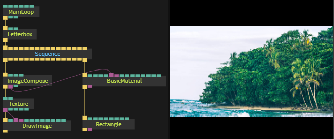
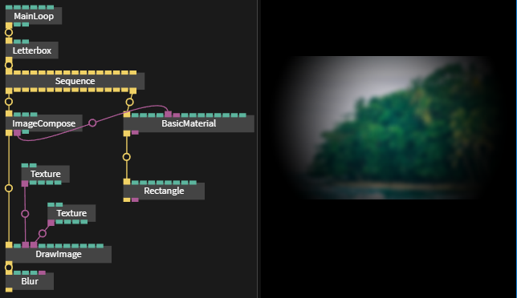

# Image Compositions

In this example we compose a new image / texture out of one image and some 2d effects.

## Basic Setup

- `Image compose` creates a new texture, the children ops of `Image Compose` apply 2D effects onto the texture
- `DrawImage` applies an image
- This example does not change the image at all, it is just a basic setup

## Apply An Effect

- To blur the image we add `Blur` to the end of the image composition chain
- The image is now blurred, you can change the `Blur` parameters, or animate them

## Add an Alpha Mask

- `DrawImage` has a a slot called `imageAlpha`
- Create a new `texture` op and connect it to the `imageAlpha` port of the `drawImage` op.
- Select it and now click `file` in the main panel. Browse through the library until you find an image like this.

- Using the `AlphaSrc` setting in the `drawImage` op you can select what defines the alpha / opacity value, in this case it's luminance of our alpha image.
- If nothing happens try changing the `AlphaSrc` setting to `alpha channel`.

## Object links
- [Letterbox](https://cables.gl/op/Ops.Gl.LetterBox)
- [Image Compose](https://cables.gl/op/Ops.Gl.ImageCompose.ImageCompose_v4)
- [Draw image](https://cables.gl/op/Ops.Gl.ImageCompose.DrawImage_v3)
- [Basic material](https://cables.gl/op/Ops.Gl.Shader.BasicMaterial_v3)
- [Rectangle](https://cables.gl/op/Ops.Gl.Meshes.Rectangle_v4)
